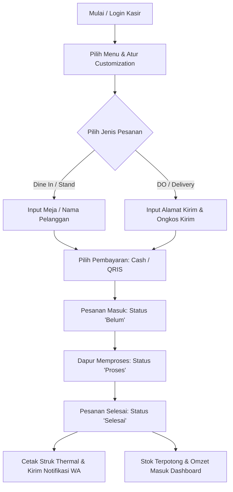

# 🍜 Hompimpa POS — Sistem Kasir & Manajemen Outlet F&B Modern

> **Solusi All-in-One Point of Sale (POS) cerdas, cepat, dan realtime untuk bisnis Kuliner, Restoran, Kafe, Mie & Pangsit, Stand Makanan, hingga Cloud Kitchen Multi-Cabang.**

Tingkatkan kecepatan pelayanan hingga **3x lipat**, kurangi human error dalam pencatatan pesanan, kelola stok dan multi-cabang dari satu genggaman, serta pantau omzet penjualan secara realtime!

---

## 🌟 Mengapa Memilih Hompimpa POS? (Fitur Unggulan)

### ⚡ 1. Kasir Cepat & Responsif (Quick Order)
* **Desain Khusus Tablet & Smartphone**: Tampilan antarmuka fleksibel yang menyesuaikan ukuran layar POS kasir (Landscape/Portrait Tablet maupun Handphone).
* **Kustomisasi Menu Interaktif**: Dukungan pilihan **Level Pedas (0–7)**, varian **Sambal (Campur/Pisah)**, dan **Add-on Topping** dinamis dengan kalkulasi harga otomatis.
* **Proses Checkout Kilat**: Input nama pelanggan, nomor meja, atau via pesanan hanya dalam hitungan detik.

### 🛵 2. Manajemen Semua Jenis Pesanan (Termasuk Delivery & Ongkir)
* **Multi-Order Channel**: Dukungan Dine-in (Makan di Tempat), Takeaway, Stand/Offline, WhatsApp Order, hingga **DO (Drop Order / Delivery)**.
* **Smart Delivery Fee (Ongkir Otomatis)**: Input ongkir manual atau pilih quick-chip praktis (Rp 5.000, 10.000, 15.000, 20.000) dengan kalkulasi grand total akurat.
* **Integrasi WhatsApp Siap Kirim**: Kirim rincian nota pesanan, alamat antar, ongkir, dan status siap ambil/kirim langsung ke nomor WhatsApp pelanggan hanya dengan 1 klik.

### 🖨️ 3. Cetak Struk Thermal & Nota Digital
* **Thermal Printer Support**: Kompatibel dengan printer Bluetooth thermal standar (58mm / 80mm).
* **Digital PDF & Preview Struk**: Pratinjau nota digital sebelum dicetak atau disimpan sebagai arsip PDF.
* **Kustomisasi Header & Footer Struk**: Pesan promosi, nomor WhatsApp outlet, dan logo toko pada struk.

### 🏢 4. Multi-Cabang & Manajemen Hak Akses (Multi-Outlet)
* **Multi-Store Management**: Kelola banyak cabang outlet dalam satu sistem terpusat.
* **Filter Data Per Cabang**: Admin dan Pemilik Bisnis dapat memantau performa per cabang atau gabungan seluruh cabang (Global).
* **Role-Based Access Control**: Pembagian peran aman untuk `Owner / Developer`, `Admin Outlet`, dan `Kasir / Staff`.

### 📊 5. Dashboard Realtime & Grafik Laporan Penjualan
* **Grafik Penjualan Otomatis**: Visualisasi grafik produk terlaris dengan label angka penjualan yang **selalu tampil permanen** di atas grafik tanpa perlu hover/klik.
* **Live Omzet & Transaksi Harian**: Pantau total rupiah, jumlah pesanan, dan metode pembayaran (Cash / QRIS) secara instan.
* **Export Laporan Excel**: Unduh rekap penjualan untuk pembukuan dan analisis bisnis lanjutan.

### 🔒 6. Fitur Keamanan, Stock Control & Void Transaksi
* **Tracking Stok Otomatis**: Stok bahan baku/produk berkurang otomatis saat pesanan selesai.
* **Sistem Void Terpantau**: Pembatalan pesanan wajib menyertakan alasan spesifik untuk mencegah kecurangan kasir.

---

## 🚀 Alur Penggunaan Aplikasi (User Flow)

### 1️⃣ Pemesanan & Checkout (Kasir)
1. Buka menu **Order Entry** pada layar Tablet atau HP.
2. Klik produk yang dipesan; tentukan jumlah, level pedas, jenis sambal, dan topping jika ada.
3. Pilih metode pesanan (**Dine In**, **Takeaway**, **Stand**, atau **DO**).
4. Jika **DO (Delivery)**, masukkan alamat pengiriman dan biaya ongkos kirim.
5. Pilih metode pembayaran (**Cash** atau **QRIS**) lalu tekan **Proses Pesanan**.

### 2️⃣ Pengelolaan Pesanan & Dapur
1. Masuk ke halaman **Pesanan Pelanggan**.
2. Pesanan baru akan tampil di tab **Belum**.
3. Tekan tombol **Proses** saat pesanan mulai disiapkan di dapur.
4. Tekan **Selesai** saat pesanan selesai dimasak/disiapkan.

### 3️⃣ Penyerahan / Pengiriman & Struk
1. Pada tab **Selesai**, tekan tombol **Print** untuk mencetak struk thermal.
2. Tekan tombol **Check / WhatsApp** untuk langsung mengirim konfirmasi rincian pesanan dan status siap kirim ke WhatsApp pelanggan.

### 4️⃣ Laporan & Pengaturan (Owner / Admin)
1. Buka **Dashboard** untuk memantau ringkasan omzet hari ini dan status stok.
2. Buka menu **Laporan Penjualan** untuk melihat grafik produk terlaris, filter tanggal/cabang, dan ekspor ke Excel.
3. Buka menu **Master Data** untuk menambah menu baru, topping, atau mengelola cabang.

---

## 🛠️ Spesifikasi Teknologi

* **Frontend Framework**: [Flutter](https://flutter.dev) (Dart)
* **State Management**: [Riverpod 2.x](https://riverpod.dev)
* **Backend & Database**: [Firebase Firestore](https://firebase.google.com/products/firestore) (Realtime Sync & Cloud Functions Ready)
* **Autentikasi**: Firebase Authentication
* **Charting**: FL Chart (Customized for persistent realtime tooltips)
* **Printing**: ESC/POS Bluetooth Thermal Printing & PDF Engine

---

## 💼 Tertarik Menggunakan / Membeli Aplikasi Ini?

Aplikasi ini siap digunakan langsung (**Ready to Deploy**) atau dapat di-kustomisasi sesuai dengan kebutuhan unik brand/bisnis Anda.

### Cocok Untuk:
- 🍜 Rumah Makan, Kedai Mie, Bakso & Soto
- ☕ Coffee Shop & Kafe
- 🍔 Fast Food, Stand Makanan & Street Food
- 🥡 Usaha Katering & Cloud Kitchen Multi-Cabang

📞 **Hubungi Tim Pengembang untuk Demo, Lisensi, atau Custom Fitur:**
* **WhatsApp / Telepon**: Hubungi Admin / Developer
* **Email**: support@hompimpapos.com
* **Website**: [PintarLabs License Platform](https://pintarlabs.com)

---
*© 2026 Hompimpa POS by PintarLabs. All Rights Reserved.*
